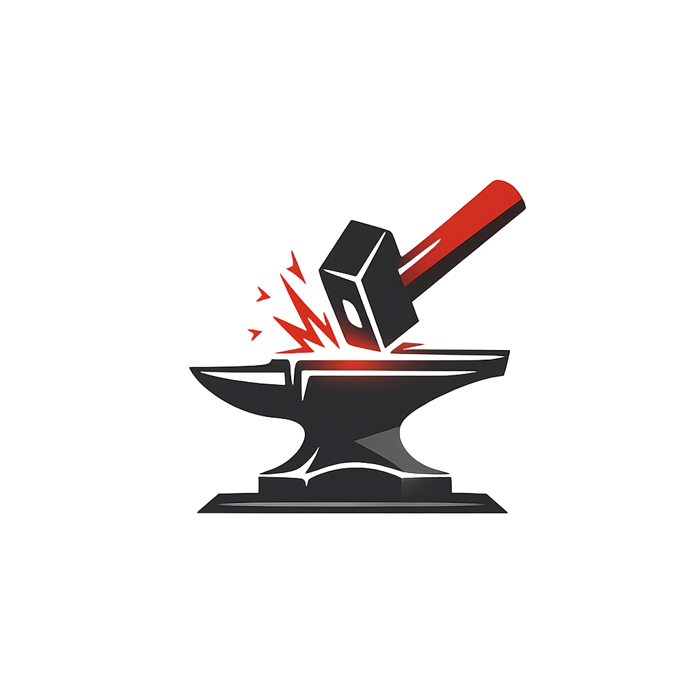

<p align="center">
  
</p>

<h1 align="center">Tanrenai (鍛錬AI)</h1>

<p align="center">A local AI assistant with agentic tool use, context windowing, and memory/RAG.<br>Download a single binary, pull a model, and start chatting.</p>

## Install

Each release bundles `llama-server` (the inference engine) — no extra downloads needed.

### Linux

**One-line install** (recommended):

```bash
curl -fsSL https://raw.githubusercontent.com/ThatCatDev/tanrenai/main/installers/install.sh | sh
```

This downloads the latest release and installs to `~/.local/bin/`.

**Debian/Ubuntu (.deb)**:

```bash
# Download the .deb from the latest release
curl -fsSLO https://github.com/ThatCatDev/tanrenai/releases/latest/download/tanrenai-<version>-amd64.deb
sudo dpkg -i tanrenai-*-amd64.deb
```

**Manual**:

```bash
tar xzf tanrenai-cli-linux-amd64.tar.gz
cd tanrenai-cli-linux-amd64
chmod +x tanrenai-cli bin/llama-server
sudo cp tanrenai-cli /usr/local/bin/tanrenai
sudo mkdir -p /usr/local/share/tanrenai/bin
sudo cp bin/llama-server /usr/local/share/tanrenai/bin/
```

### macOS

**One-line install** (recommended):

```bash
curl -fsSL https://raw.githubusercontent.com/ThatCatDev/tanrenai/main/installers/install.sh | sh
```

**Manual**:

```bash
tar xzf tanrenai-cli-darwin-arm64.tar.gz   # or darwin-amd64 for Intel
cd tanrenai-cli-darwin-arm64
chmod +x tanrenai-cli bin/llama-server
cp tanrenai-cli ~/.local/bin/tanrenai
mkdir -p ~/.local/share/tanrenai/bin
cp bin/llama-server ~/.local/share/tanrenai/bin/
```

### Windows

**Installer (recommended):** Download `tanrenai-cli-windows-amd64-setup.exe` from [Releases](https://github.com/ThatCatDev/tanrenai/releases). Adds `tanrenai` to your PATH and shows up in Add/Remove Programs.

**Manual:** Download `tanrenai-cli-windows-amd64.zip`, extract it, and run from that folder.

### All platforms

| Platform | File | GPU Support |
|----------|------|-------------|
| Linux x64 | `tanrenai-cli-linux-amd64.tar.gz` | CPU |
| macOS Intel | `tanrenai-cli-darwin-amd64.tar.gz` | - |
| macOS Apple Silicon | `tanrenai-cli-darwin-arm64.tar.gz` | Metal |
| Windows x64 | `tanrenai-cli-windows-amd64.zip` | NVIDIA CUDA 12.4 |

## Quick Start

The CLI embeds the GPU server and backend in a single binary — no separate services needed.

### 1. Pull a model

Download a GGUF model from Hugging Face:

```bash
tanrenai --local pull https://huggingface.co/unsloth/Qwen3-8B-GGUF/resolve/main/Qwen3-8B-Q4_K_M.gguf
```

Models are stored in `~/.local/share/tanrenai/models/` (Linux/macOS) or `%LOCALAPPDATA%\tanrenai\models\` (Windows).

### 2. Chat with a model

```bash
# Basic chat
tanrenai --local run Qwen3-8B-Q4_K_M

# Agent mode with tool use
tanrenai --local run Qwen3-8B-Q4_K_M --agent

# Agent mode with memory/RAG
tanrenai --local run Qwen3-8B-Q4_K_M --agent --memory
```

### 3. List available models

```bash
tanrenai --local list
```

## CLI Reference

```
tanrenai [flags] <command>

Commands:
  run <model>     Load a model and start interactive chat
  pull <url>      Download a GGUF model
  list            List available models
  version         Print version information

Global Flags:
  --local               Run with embedded servers (recommended)
  --server-url string   Connect to a remote backend instead (default "http://127.0.0.1:8080")
  --gpu-layers int      GPU offload layers; -1 = all (default -1)
  --flash-attn          Enable flash attention (default true)

Run Flags:
  --agent               Enable agent mode with tool calling
  --memory              Enable persistent memory/RAG
  --system string       Custom system prompt
  --system-file string  Load system prompt from file
  --ctx-size int        Override context size (0 = auto-detect from model)
  --max-iterations int  Max agent iterations per turn (default 25)
  --context-file strings  Inject files into context
```

## Agent Mode

In agent mode, the model can use tools to interact with your filesystem and system:

`file_read`, `file_write`, `patch_file`, `list_dir`, `find_files`, `grep_search`, `git_info`, `shell_exec`, `web_search`

```bash
tanrenai --local run Qwen3-8B-Q4_K_M --agent
```

### Tool Permissions

When the agent invokes a tool, you'll be prompted to approve it. The options depend on the tool's risk level:

**Read-only tools** (`file_read`, `list_dir`, `find_files`, `grep_search`, `git_info`):
- **Allow** — run this once
- **Always Allow** — blanket-approve this tool
- **Block** — skip the call

**File-writing tools** (`file_write`, `patch_file`):
- **Allow** — run this once
- **Always (path)** — always allow this specific file path
- **Always (all)** — blanket-approve all writes
- **Block** — skip the call

**Shell commands** (`shell_exec`):
- **Allow** — run this once
- **Always (git \*)** — always allow commands starting with `git` (or whichever prefix)
- **Block** — skip the call

Shell commands cannot be blanket-approved — you must approve by command prefix for safety.

Use arrow keys or mouse to select, Enter to confirm. Permissions are saved to `.tanrenai/permissions.json` in the current directory and merged with `~/.tanrenai/permissions.json` (global).

## Memory / RAG

Enable persistent memory so the model remembers across conversations:

```bash
tanrenai --local run Qwen3-8B-Q4_K_M --agent --memory
```

Memories are stored locally in a vector database with embeddings generated by the model.

## REPL Commands

While chatting, use these slash commands:

- `/memory` — view stored memories
- `/context` — show current context window
- `/tokens` — display token budget usage
- `/clear` — reset the conversation

## Context Size

Context size is auto-detected from GGUF model metadata. Override it if needed:

```bash
# Auto-detect (default)
tanrenai --local run Qwen3-8B-Q4_K_M --agent

# Force 8192 tokens
tanrenai --local run Qwen3-8B-Q4_K_M --agent --ctx-size 8192
```

## GPU Acceleration

By default, all layers are offloaded to the GPU (`--gpu-layers -1`). Adjust if you have limited VRAM:

```bash
# Offload 20 layers to GPU, rest on CPU
tanrenai --local run Qwen3-8B-Q4_K_M --agent --gpu-layers 20

# CPU only
tanrenai --local run Qwen3-8B-Q4_K_M --agent --gpu-layers 0
```

## Desktop App

A GTK4/Adwaita desktop app is also available from [Releases](https://github.com/ThatCatDev/tanrenai/releases). It embeds everything in a GUI — no terminal needed.

| Platform | Notes |
|----------|-------|
| Linux | Requires GTK 4 and libadwaita: `sudo apt install libgtk-4-1 libadwaita-1-0` |
| macOS | Requires GTK 4 and libadwaita: `brew install gtk4 libadwaita` |
| Windows | **Installer:** `tanrenai-desktop-windows-amd64-setup.exe` (adds to PATH + Start Menu). Or use the `.zip` for manual install. |

## Advanced: Three-Tier Setup

For remote GPU servers or multi-machine setups, run the tiers separately:

```bash
# GPU server (on the machine with the GPU)
tanrenai-gpu serve --port 11435

# Backend (can run anywhere, points at GPU server)
tanrenai-server serve --gpu-url http://gpu-host:11435 --memory --port 8080

# CLI (connects to backend)
tanrenai run model-name --agent --memory --server-url http://backend-host:8080
```

## Architecture

```
Clients (clients/)  →  Backend (server/)  →  GPU Server (gpu/)
CLI, Desktop           memory/RAG, proxy,    llama-server,
agent loop             vast.ai mgmt          models, fine-tuning
```

Three independent Go modules communicating via JSON over HTTP. In `--local` mode, all three are embedded in the CLI binary.

## Building from Source

```bash
# Build and install CLI to ~/.local/bin/
make install

# Or build individual components
make build          # CLI only
make build-all      # CLI + GPU server + backend

# Desktop (requires GTK4 dev libraries)
cd clients/desktop/ && go build -o tanrenai-desktop .
```

## Testing

```bash
make test
```

## License

See [LICENSE](LICENSE) for details.
