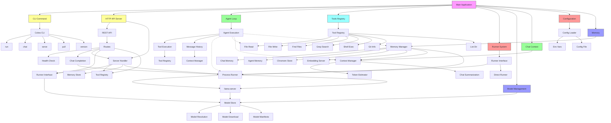

```mermaid
graph TD
    %% Main Components
    A[Main Application] --> B[CLI Command]
    A --> C[HTTP API Server]
    A --> D[Agent Loop]
    A --> E[Tools Registry]
    A --> F[Runner System]
    A --> G[Model Management]
    A --> H[Chat Context]
    A --> I[Configuration]
    A --> J[Memory]
    
    %% CLI Commands
    B --> B1[Cobra CLI]
    B1 --> B2[run]
    B1 --> B3[chat]
    B1 --> B4[serve]
    B1 --> B5[pull]
    B1 --> B6[version]
    
    %% HTTP Server
    C --> C1[REST API]
    C1 --> C2[Routes]
    C2 --> C3[Health Check]
    C2 --> C4[Chat Completion]
    C2 --> C5[Agent Completion]
    C2 --> C6[Model Load]
    C2 --> C7[Finetune Endpoints]
    
    %% Agent Loop
    D --> D1[Agent Execution]
    D1 --> D2[Tool Execution]
    D2 --> D3[Tool Registry]
    D1 --> D4[Message History]
    D4 --> D5[Context Manager]
    
    %% Tools Registry
    E --> E1[Tool Registry]
    E1 --> E2[File Read]
    E1 --> E3[File Write]
    E1 --> E4[Find Files]
    E1 --> E5[Grep Search]
    E1 --> E6[Shell Exec]
    E1 --> E7[Git Info]
    E1 --> E8[List Dir]
    
    %% Runner System
    F --> F1[Runner Interface]
    F1 --> F2[Process Runner]
    F2 --> F3[llama-server]
    F1 --> F4[Direct Runner]
    
    %% Model Management
    G --> G1[Model Store]
    G1 --> G2[Model Resolution]
    G1 --> G3[Model Download]
    G1 --> G4[Model Manifests]
    
    %% Chat Context
    H --> H1[Context Manager]
    H1 --> H2[Token Estimator]
    H1 --> H3[Chat Summarization]
    
    %% Configuration
    I --> I1[Config Loader]
    I1 --> I2[Env Vars]
    I1 --> I3[Config File]
    
    %% Memory
    J --> J1[Memory Manager]
    J1 --> J2[Chat Memory]
    J1 --> J3[Agent Memory]
    J1 --> J4[Chromem Store]
    J1 --> J5[Embedding Server]
    
    %% Server Components
    C --> C5[Server Handler]
    C5 --> C6[Runner Interface]
    C5 --> C7[Tool Registry]
    C5 --> C8[Memory Store]
    
    %% Connections
    D1 -.-> F2
    D1 -.-> E2
    D1 -.-> H1
    D1 -.-> J1
    
    F2 --> F3
    F3 --> G1
    
    C4 --> F2
    C5 --> F2
    C6 --> G1
    
    J1 --> H1
    J1 --> F2
    
    style A fill:#f9f,stroke:#333
    style B fill:#ff9,stroke:#333
    style C fill:#ff9,stroke:#333
    style D fill:#9f9,stroke:#333
    style E fill:#9ff,stroke:#333
    style F fill:#f99,stroke:#333
    style G fill:#99f,stroke:#333
    style H fill:#9f9,stroke:#333
    style I fill:#f99,stroke:#333
    style J fill:#99f,stroke:#333
```